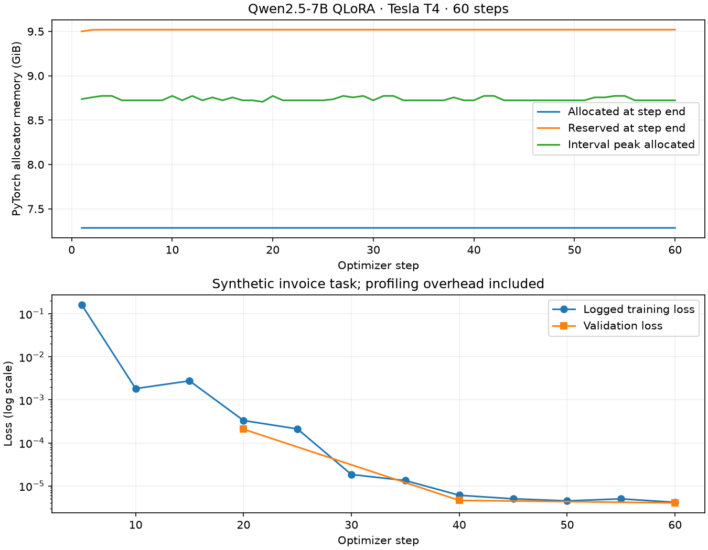

# Verified free-Colab T4 profiling run

Qwen/Qwen2.5-7B-Instruct, NF4 QLoRA with PEFT, FP16. Source commit `e095fc7349358c30c8000e9fe11a66eaa6bcc2f3`; immutable model revision and dataset hashes appear in report.json. This is a new run, not a change to the earlier GPU report.

- 60 optimizer steps, 400 training / 40 validation examples, fixed 16 synthetic test cases.
- 665 CUDA allocator snapshots; all 60 step-end records and 3 evaluation records verified.
- Peak allocated: 8.773 GiB; peak reserved: 9.543 GiB. PyTorch allocator measurements, not all device VRAM.
- Training: 650.873 seconds including profiling overhead. Not a controlled speed comparison with the previous run.
- Two active optimizer intervals: 2,068,683 events including 166,802 CUDA kernel and 4,628 GPU memcpy events. Kernel durations sum to 12.057 s, memcpy to 0.040 s in the captured window. Overlapping categories are not wall-time fractions or proof of an overall bottleneck.
- Adapter: 16/16 strict exact/schema-valid outputs. Baseline: 0/16 strict; stripping only outer Markdown fences gives 13/16 exact and 15/16 valid. Small synthetic task, not general real-document accuracy.
- Exported adapter hashes and dataset hashes match; checkpoint confirms step 60; 224 finite LoRA tensors total 10,092,544 parameters.

The 706,351,354-byte Chrome trace is retained locally under ignored runs/profile-imported-bcec73883046/profile/training-trace.json and excluded from Git. Compact report, memory events, operator table and validation summary are published here. Validator reads JSON and safetensors only; optimizer/pickle files are not loaded. No local GPU inference replay, multi-GPU FSDP/ZeRO, AWQ conversion or serving benchmark is claimed.
